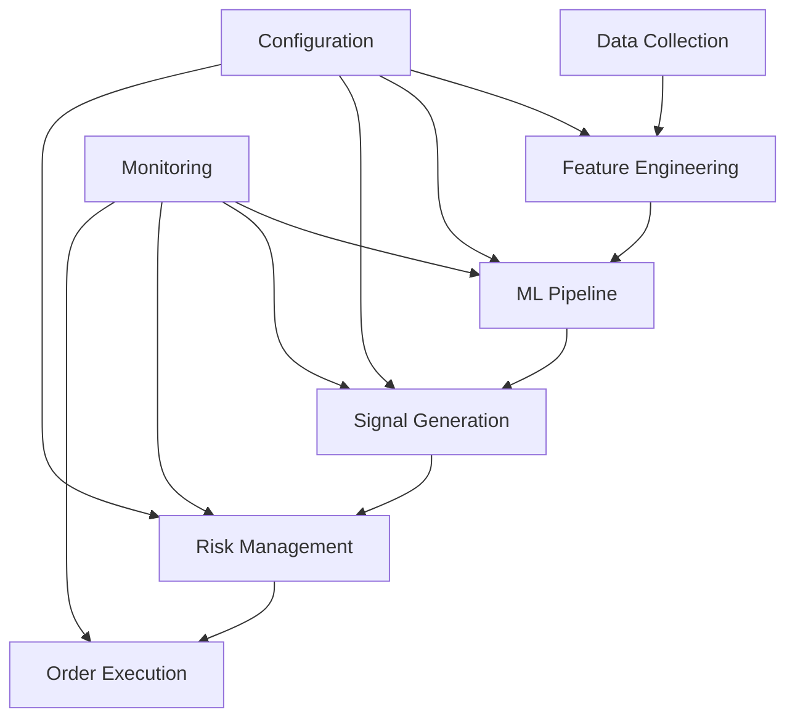
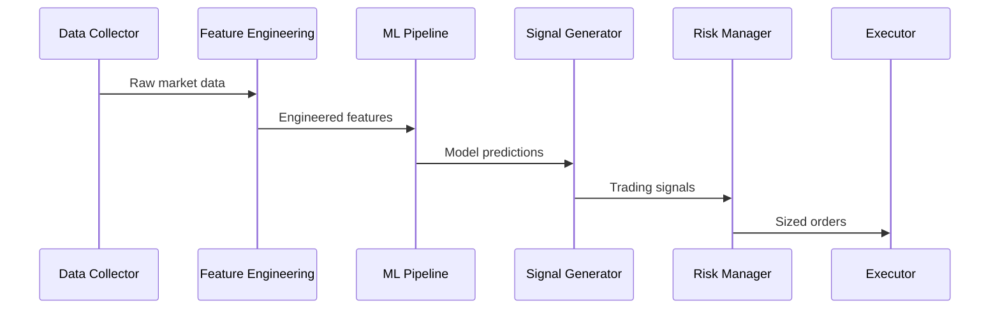
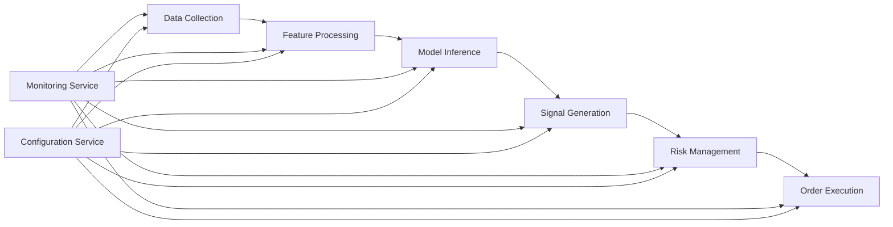

# System Architecture

## Overview

The ML Trading System is built with a modular, pipeline-based architecture that separates concerns into distinct components while maintaining flexibility and extensibility. This document describes the system's architecture, components, and their interactions.

## High-Level Architecture



## Core Components

### 1. Data Pipeline (`utils/data_feed.py`)
- Handles data collection and preprocessing
- Supports multiple data sources (CSV, API)
- Implements data validation and cleaning
- Manages efficient data storage and retrieval

### 2. Feature Engineering (`utils/feature_engineering.py`)
- Calculates technical indicators
- Generates market regime features
- Implements pattern recognition
- Handles feature selection and optimization

### 3. ML Pipeline (`utils/ml_pipeline.py`)
- Manages model training and evaluation
- Implements feature selection
- Handles model persistence and loading
- Provides prediction interfaces

### 4. Signal Generation (`strategies/ml_strategy.py`)
- Generates trading signals from model predictions
- Implements position sizing logic
- Manages entry/exit rules
- Handles signal filtering and validation

### 5. Risk Management (`utils/risk_management.py`)
- Implements position sizing
- Manages stop-loss and take-profit levels
- Handles portfolio risk constraints
- Provides drawdown protection

### 6. Performance Monitoring (`utils/monitoring.py`)
- Tracks model performance metrics
- Monitors feature drift
- Generates performance reports
- Handles alerting and notifications

## Data Flow



## Configuration System

The system uses a hierarchical configuration system:

```yaml
data_config:
  - Data source settings
  - Preprocessing parameters

features_config:
  - Technical indicators
  - Market regime features
  - Pattern recognition

model_config:
  - Model parameters
  - Training settings
  - Prediction thresholds

risk_config:
  - Position sizing rules
  - Risk limits
  - Stop-loss/Take-profit
```

## Optimization Components

### 1. Performance Optimizations
- Parallel feature calculation
- Memory-efficient data processing
- Caching system for frequent calculations

### 2. Model Optimizations
- Automated feature selection
- Hyperparameter optimization
- Model retraining triggers

### 3. Risk Management Optimizations
- Dynamic position sizing
- Adaptive risk parameters
- Market regime-based adjustments

## Monitoring and Maintenance

### 1. Model Monitoring
- Performance metrics tracking
- Feature drift detection
- Prediction quality assessment

### 2. System Maintenance
- Automated model retraining
- Data quality checks
- Performance optimization

## Error Handling

The system implements comprehensive error handling:

1. Data Validation
- Input data validation
- Feature completeness checks
- Data quality assessments

2. Model Validation
- Prediction sanity checks
- Model performance monitoring
- Feature drift detection

3. Risk Checks
- Position size validation
- Risk limit enforcement
- Portfolio exposure checks

## Development Guidelines

### 1. Code Organization
- Modular component design
- Clear separation of concerns
- Consistent interface definitions

### 2. Testing Strategy
- Unit tests for components
- Integration tests for pipelines
- Performance benchmarks

### 3. Documentation
- Inline code documentation
- API documentation
- Configuration guides

## Deployment Architecture



## Performance Considerations

### 1. Data Processing
- Efficient data structures
- Parallel processing
- Memory management
- Caching strategies

### 2. Model Inference
- Batch prediction
- Model optimization
- Resource management

### 3. Risk Management
- Real-time calculations
- Position adjustments
- Portfolio rebalancing

## Future Extensions

1. Additional Data Sources
- Real-time market data
- Alternative data integration
- Sentiment analysis

2. Enhanced Models
- Deep learning models
- Ensemble methods
- Online learning

3. Advanced Risk Management
- Portfolio optimization
- Multi-asset correlation
- Dynamic risk adjustment 