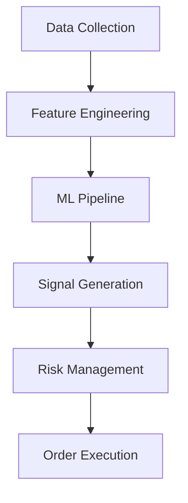

# Backtrader: ML-Powered Cryptocurrency Trading System

## Overview

Backtrader is a sophisticated cryptocurrency trading system that combines machine learning with robust trading strategies. The system uses advanced ML models to predict market movements and generate trading signals, while implementing comprehensive risk management and portfolio optimization.



## Features

### Data Processing
- Real-time market data collection
- Advanced feature engineering
- Efficient data preprocessing
- Parallel computation support

### Machine Learning
- XGBoost-based prediction models
- Feature selection and importance analysis
- Model performance monitoring
- Automated model retraining

### Trading Strategy
- ML-driven signal generation
- Dynamic position sizing
- Multiple timeframe analysis
- Advanced entry/exit rules

### Risk Management
- Position size optimization
- Portfolio risk controls
- Dynamic stop-loss/take-profit
- Exposure management

### Performance
- Parallel processing
- Memory-efficient operations
- Caching system
- Performance monitoring

## Installation

### Prerequisites
- Python 3.8+
- pip
- git
- Virtual environment tool

### Setup

1. Clone the repository:
```bash
git clone https://github.com/yourusername/backtrader.git
cd backtrader
```

2. Create and activate virtual environment:
```bash
python -m venv venv
source venv/bin/activate  # Linux/Mac
venv\Scripts\activate     # Windows
```

3. Install dependencies:
```bash
pip install -r requirements.txt
```

4. Install development dependencies (optional):
```bash
pip install -r requirements-dev.txt
```

## Quick Start

### 1. Configure the System

Create or modify `config/settings.py`:
```python
TRADING_PAIRS = ['BTCUSDT']
TIMEFRAMES = ['1h']
RISK_LIMITS = {
    'max_position_size': 1.0,
    'max_drawdown': 0.20
}
```

### 2. Run Backtesting

```bash
python scripts/run_ml_backtest.py \
    --config config/ml_pipeline_config.yaml \
    --data-file data/btcusdt_prices.csv \
    --output-dir results/
```

### 3. Train ML Model

```bash
python scripts/run_ml_pipeline.py \
    --config config/ml_pipeline_config.yaml \
    --train-data data/btcusdt_ml_dataset.csv \
    --model-dir models/
```

### 4. Run Trading Strategy

```bash
python scripts/run_ml_strategy.py \
    --config config/settings.py \
    --model models/xgboost_model.pkl
```

## Documentation

- [Technical Documentation](docs/TECHNICAL_DOCS.md)
- [API Reference](docs/API.md)
- [Architecture Guide](docs/ARCHITECTURE.md)
- [Developer Guide](docs/DEVELOPER_GUIDE.md)

## Project Structure

```
backtrader/
├── analysis/           # Analysis tools
├── backtest/          # Backtesting engine
├── config/            # Configuration files
│   ├── file_paths.yaml       # File path configuration
│   ├── ml_pipeline_config.yaml
│   ├── robustness_config.py
│   ├── settings.py
│   └── walk_forward_config.py
├── data/              # Data storage
│   ├── raw/          # Raw market data (e.g., BTCUSDT prices)
│   ├── features/     # Feature datasets (e.g., ML datasets)
│   ├── processed/    # Processed data files
│   └── cache/        # Cached computations
├── docs/              # Documentation
│   ├── API.md
│   ├── ARCHITECTURE.md
│   ├── DEVELOPER_GUIDE.md
│   └── TECHNICAL_DOCS.md
├── indicators/        # Technical indicators
├── models/           # Trained models
│   ├── random_forest/  # Random Forest models
│   ├── xgboost/       # XGBoost models
│   └── metadata/      # Model metadata
├── results/          # Analysis results
│   ├── feature_importance/  # Feature importance data
│   ├── metrics/            # Performance metrics
│   └── plots/             # Generated plots
├── scripts/          # Utility scripts
├── strategies/       # Trading strategies
├── tests/            # Test suite
└── utils/            # Utility functions
```

## Configuration

### Data Configuration
```yaml
data:
  source: binance
  pairs:
    - BTCUSDT
    - ETHUSDT
  timeframes:
    - 1h
    - 4h
```

### Model Configuration
```yaml
model:
  type: xgboost
  params:
    n_estimators: 1000
    max_depth: 8
    learning_rate: 0.01
```

### Trading Configuration
```yaml
trading:
  risk_limits:
    max_position_size: 1.0
    max_drawdown: 0.20
  thresholds:
    entry: 0.40
    exit: 0.35
```

## Performance Metrics

The system tracks various performance metrics:

1. Trading Performance
- Sharpe Ratio
- Maximum Drawdown
- Win Rate
- Profit Factor

2. Risk Metrics
- Value at Risk (VaR)
- Expected Shortfall
- Portfolio Beta
- Correlation Matrix

3. System Metrics
- Processing Time
- Memory Usage
- Model Accuracy
- Signal Quality

## Development

### Running Tests

```bash
# Run all tests
pytest

# Run specific test file
pytest tests/test_trading_strategy.py

# Run with coverage
pytest --cov=backtrader tests/
```

### Code Style

```bash
# Format code
black .

# Run linter
pylint backtrader

# Run type checker
mypy backtrader
```

## Contributing

1. Fork the repository
2. Create feature branch
3. Add tests
4. Update documentation
5. Submit pull request

See [CONTRIBUTING.md](CONTRIBUTING.md) for detailed guidelines.

## License

This project is licensed under the MIT License - see the [LICENSE](LICENSE) file for details.

## Acknowledgments

- [XGBoost](https://xgboost.readthedocs.io/) for ML models
- [pandas](https://pandas.pydata.org/) for data processing
- [TA-Lib](https://ta-lib.org/) for technical indicators
- [Binance API](https://binance-docs.github.io/apidocs/) for market data

## Contact

- Author: Your Name
- Email: your.email@example.com
- GitHub: [@yourusername](https://github.com/yourusername)

## Roadmap

### Version 1.1
- Real-time trading support
- Additional ML models
- Enhanced risk metrics
- Web interface

### Version 1.2
- Multi-exchange support
- Portfolio optimization
- Advanced order types
- Performance improvements

### Version 2.0
- Distributed computing
- Deep learning models
- Real-time monitoring
- Strategy marketplace 