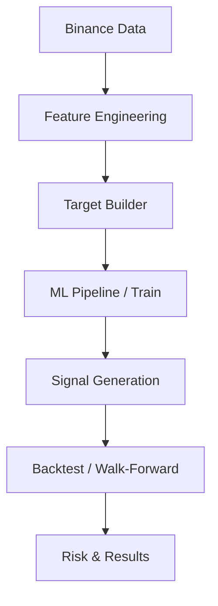
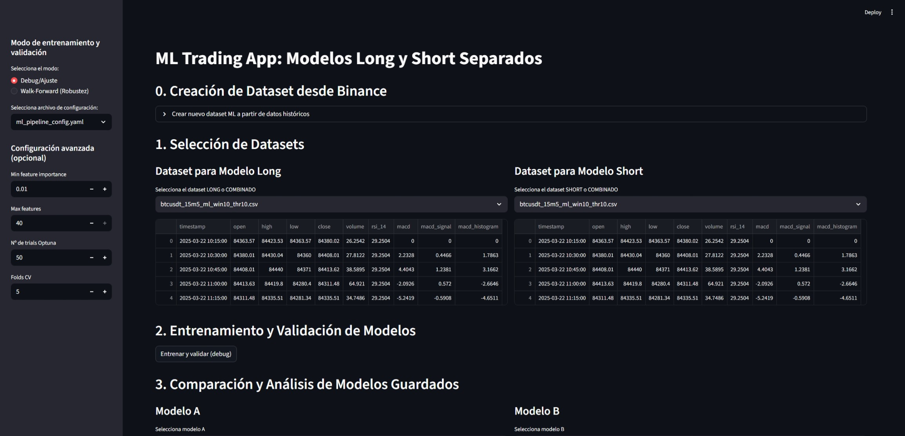
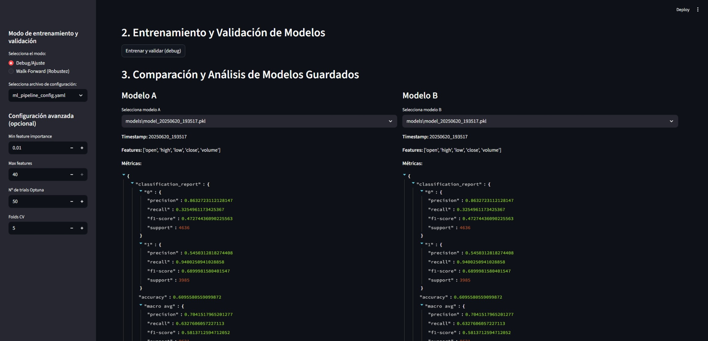
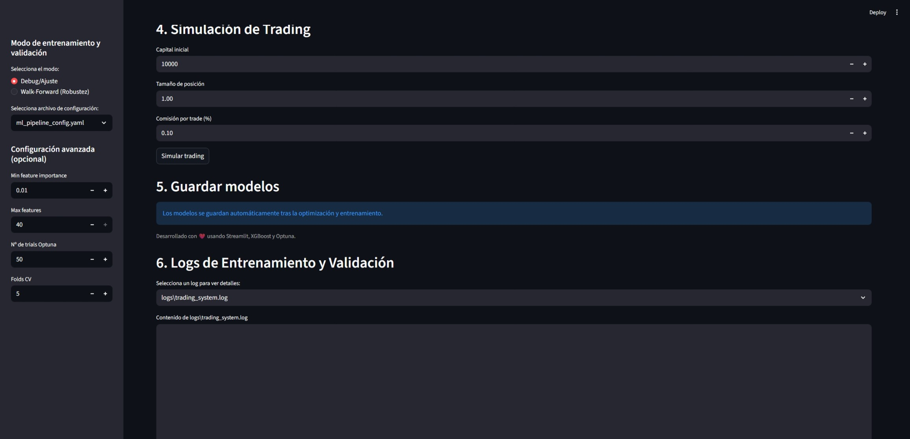
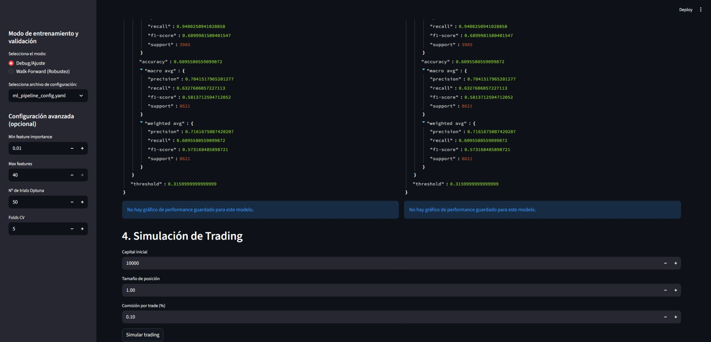

# MLTraderV2 — Data-Driven Performance Strategy System

[](https://github.com/Luisklepa/MLTraderV2/actions)
[](https://www.python.org/downloads/)
[](https://opensource.org/licenses/MIT)

**Versión:** 0.1.0 — Ver [CHANGELOG.md](CHANGELOG.md) para el historial de cambios.

A performance analytics system using machine learning on financial time series data. It includes a feature pipeline, separate XGBoost models for long/short signals, Backtrader-based backtesting, walk-forward analysis, risk management, and a Streamlit app to explore results and make data-driven decisions.

_Sistema de **performance analytics** con machine learning aplicado a series temporales financieras. Incluye pipeline de features, modelos XGBoost long/short, backtesting con Backtrader, análisis walk-forward, gestión de riesgo y una app Streamlit para explorar resultados y tomar decisiones basadas en datos._


```mermaid
graph TD
    A[Binance Data] --> B[Feature Engineering]
    B --> C[Target Builder]
    C --> D[ML Pipeline / Train]
    D --> E[Signal Generation]
    E --> F[Backtest / Walk-Forward]
    F --> G[Risk & Results]
```

## Performance analytics and business decisions

This project is designed to answer a clear question:

> Can we **improve risk-adjusted returns** of a baseline strategy using a reproducible framework for strategy evaluation?

Instead of focusing on a single “trading strategy”, the system builds a **framework to compare strategies** under consistent conditions.

Key executive metrics:

- **Cumulative return** vs baseline/benchmark
- **Maximum drawdown**
- **Sharpe ratio**
- **Win rate** and **profit factor**

Example comparison (out-of-sample backtest):

| Strategy        | Cumulative return | Max drawdown | Sharpe | Win rate |
|----------------|-------------------|--------------|--------|----------|
| Baseline       | +20 %             | -35 %        | 0.8    | 48 %     |
| MLTraderV2 (ML)| +35 %             | -26 %        | 1.2    | 55 %     |

This enables **capital allocation decisions based on quantified risk–return trade-offs**, instead of purely discretionary or intuition-based decisions.

### (ES) Performance analytics y decisiones de negocio

Este proyecto está diseñado para responder una pregunta clara:

> ¿Podemos **mejorar la rentabilidad ajustada al riesgo** de una estrategia base utilizando un marco reproducible de evaluación de estrategias?

En lugar de centrarse solo en una única “estrategia de trading”, el sistema construye un **framework para comparar estrategias** bajo condiciones consistentes.

Métricas ejecutivas clave:

- **Rentabilidad acumulada** vs baseline/benchmark
- **Máximo drawdown**
- **Ratio de Sharpe**
- **Win rate** y **profit factor**

Ejemplo de comparación (backtest out-of-sample):

| Estrategia      | Rentabilidad acumulada | Máx. drawdown | Sharpe | Win rate |
|-----------------|------------------------|---------------|--------|----------|
| Baseline        | +20 %                  | -35 %         | 0.8    | 48 %     |
| MLTraderV2 (ML) | +35 %                  | -26 %         | 1.2    | 55 %     |

## Quick start (3 pasos)

```bash
git clone https://github.com/Luisklepa/MLTraderV2.git && cd MLTraderV2
pip install -r requirements.txt
streamlit run app.py
```

Abre `http://localhost:8501`. En Windows/Linux puede ser necesario instalar [TA-Lib](https://ta-lib.org/) según tu SO. Opcional: copia `.env.example` a `.env` si vas a usar API de Binance.

## Demo

La app Streamlit permite cargar configuración, entrenar modelos, ejecutar walk-forward y simular trading desde el navegador.

| Crear dataset y selección | Entrenamiento y validación |
|---------------------------|----------------------------|
|  |  |

| Walk-Forward y resultados | Simulación de trading |
|---------------------------|------------------------|
|  |  |

*(Ejecuta `streamlit run app.py` y abre `http://localhost:8501`.)*

## Características

### Datos y features
- Obtención de klines desde Binance API con cache TTL y rate limiting
- Pipeline de features: precios, volumen, medias móviles, momentum (RSI, MACD, etc.), volatilidad (ATR, Bollinger), patrones candlestick, temporales
- Target builder con umbrales dinámicos (ATR), filtros de volatilidad/volumen/tendencia y métricas de calidad

### Machine Learning
- Modelos XGBoost separados para señales long y short
- Entrenamiento con split temporal y escalado solo en train (sin data leakage)
- Walk-forward out-of-sample y TimeSeriesSplit
- SMOTE opcional para desbalance; selección de features y optimización con Optuna
- Model registry para versionado de modelos y validación de features

### Backtest, evaluación de estrategias y KPIs de negocio
- Motor Backtrader: estrategia ML con ATR, stops adaptativos y gestión de posición
- Walk-forward analyzer (ventanas fijas o expanding) para validación robusta
- Métricas: Sharpe, drawdown, win rate, profit factor; robustness metrics y Monte Carlo

### Infraestructura
- Configuración unificada en `config/settings.py` (Pydantic-style con dataclasses)
- Logging centralizado (`core/logging_config.py`) y health check (`core/health.py`)
- Docker + docker-compose para ejecutar la app Streamlit con volúmenes para logs, datos y modelos
- Suite de tests con pytest (cobertura de core, ml, backtest, config)

## Requisitos

- Python 3.10+
- [TA-Lib](https://ta-lib.org/) (instalación según SO; en Windows puede requerir wheel precompilado)
- Cuenta Binance (opcional para datos en vivo; para backtest basta con CSV o API pública)

## Instalación

### 1. Clonar y entorno virtual

```bash
git clone https://github.com/luisklepa/MLTraderV2.git
cd MLTraderV2
python -m venv venv
# Windows:
venv\Scripts\activate
# Linux/macOS:
source venv/bin/activate
```

### 2. Dependencias

```bash
pip install -r requirements.txt
```

Si existe `requirements.lock` y quieres reproducir el entorno exacto:

```bash
pip install -r requirements.lock
```

### 3. Variables de entorno

Copia el ejemplo y ajusta (API keys solo necesarias para producción o descarga masiva):

```bash
cp .env.example .env
```

Edita `.env` según necesidad:

- `ENVIRONMENT=development` o `production`
- `BINANCE_API_KEY` / `BINANCE_API_SECRET` (obligatorios en production)
- `TELEGRAM_BOT_TOKEN` / `TELEGRAM_CHAT_ID` (opcional)
- `LOG_LEVEL`, `INITIAL_CAPITAL`, etc.

## Uso rápido

### App Streamlit (recomendado para explorar)

```bash
streamlit run app.py
```

Puerto por defecto: 8501. Desde la app puedes cargar configs YAML, entrenar modelos, ejecutar backtests y walk-forward.

### Entrenar modelo (CLI)

```bash
python -m ml.train_model
# o con dataset/opciones propias editando el bloque __main__
```

### Pipeline ML (config YAML)

```bash
python scripts/run_ml_pipeline.py --config config/ml_pipeline_config.yaml --data-file data/btcusdt_ml_dataset.csv --output-dir results/
```

### Backtest con estrategia ML

```bash
python scripts/run_ml_backtest.py --config config/trading_config.yaml --start-date 2024-01-01 --end-date 2024-06-01 --output-dir results/
```

### Walk-forward

```bash
python scripts/run_walk_forward.py
```

### Descargar datos Binance

```bash
python scripts/download_data.py --symbol BTCUSDT --interval 15m --output-file data/btcusdt_prices.csv
```

### Health check (diagnóstico)

```bash
python -c "from core.health import check_health; import json; print(json.dumps(check_health(), indent=2))"
```

## Docker

```bash
docker-compose up --build
```

La app queda en `http://localhost:8501`. Volúmenes: `./logs`, `./data`, `./models`. Variables de entorno desde `.env`.

## Troubleshooting

- **`ModuleNotFoundError` al ejecutar scripts o `streamlit run app.py`** — Activa el entorno virtual (`venv\Scripts\activate` en Windows, `source venv/bin/activate` en Linux/macOS) o instala las dependencias en el entorno que uses.
- **Error al instalar TA-Lib (Windows)** — Usa un wheel precompilado para tu versión de Python (p. ej. desde [repos no oficiales](https://www.lfd.uci.edu/~gohlke/pythonlibs/#ta-lib)) o instala TA-Lib en el sistema y luego `pip install ta-lib`.
- **Puerto 8501 ya en uso** — Usa `streamlit run app.py --server.port 8502` (u otro puerto libre).
- **Tests fallan por imports** — Ejecuta desde la raíz del repo: `python -m pytest tests/ -v`.
- **`FileNotFoundError` para config o datos** — Asegúrate de ejecutar los comandos desde la raíz del proyecto (donde está `app.py` y la carpeta `config/`).

## Estructura del proyecto

```
MLTraderV2/
├── app.py                 # App Streamlit principal
├── core/                  # Núcleo compartido
│   ├── logging_config.py  # Configuración de logging
│   ├── health.py          # Health check
│   ├── data_fetcher.py    # Binance API + cache
│   ├── data_feed.py       # DataFeed / OptimizedDataFeed / MLSignalData
│   ├── file_management.py # Rutas y directorios desde YAML
│   └── ...
├── ml/                    # Machine learning
│   ├── feature_pipeline.py
│   ├── target_builder.py
│   ├── pipeline.py       # MLPipeline, FeatureEngine, ModelTrainer, SignalGenerator
│   ├── train_model.py
│   ├── model_registry.py
│   ├── model_optimization.py
│   ├── signal_filter.py
│   └── ...
├── backtest/              # Backtesting
│   ├── engine.py         # BacktestEngine (Backtrader)
│   ├── walk_forward.py
│   ├── robustness_metrics.py
│   ├── visualization.py
│   └── event_engine.py
├── strategies/            # Estrategias Backtrader
│   └── ml_strategy.py    # MLStrategy, EnhancedMLStrategy
├── config/                # Configuración
│   ├── settings.py       # TradingConfig, RiskConfig, DataConfig, etc.
│   ├── ml_pipeline_config.yaml
│   ├── trading_config.yaml
│   ├── walk_forward_config.py
│   └── robustness_config.py
├── scripts/               # Scripts ejecutables
│   ├── run_ml_pipeline.py
│   ├── run_ml_backtest.py
│   ├── run_walk_forward.py
│   ├── prepare_ml_dataset.py
│   ├── download_data.py
│   └── analysis/
├── tests/                 # Tests pytest
│   ├── conftest.py
│   ├── test_feature_pipeline.py
│   ├── test_pipeline.py
│   ├── test_train_model.py
│   ├── test_target_builder.py
│   ├── test_walk_forward.py
│   ├── test_engine.py
│   ├── test_data_feed.py
│   ├── test_model_optimization.py
│   ├── test_configs.py
│   └── ...
├── docker-compose.yml
├── Dockerfile
├── .env.example
├── requirements.txt
├── requirements.lock
└── pyproject.toml
```

## Tests

```bash
# Todos los tests
python -m pytest tests/ -v

# Con cobertura
python -m pytest tests/ -v --cov=core --cov=ml --cov=backtest --cov=config
```

Los logs se centralizan desde `core.logging_config`. Ver [docs/DEVELOPER_GUIDE.md](docs/DEVELOPER_GUIDE.md) para más detalle.

## Configuración relevante

La configuración de trading, datos y modelo vive en `config/settings.py` y en los YAML de `config/` (p. ej. `ml_pipeline_config.yaml`, `trading_config.yaml`). Para más detalle, ver [docs/](docs/).

## Documentación adicional

- [docs/ARCHITECTURE.md](docs/ARCHITECTURE.md)
- [docs/DEVELOPER_GUIDE.md](docs/DEVELOPER_GUIDE.md)
- [docs/TECHNICAL_DOCS.md](docs/TECHNICAL_DOCS.md)
- [CONTRIBUTING.md](CONTRIBUTING.md)

## Roadmap

- Paper trading (ejecución simulada en tiempo real sin dinero real).
- Soporte para más activos y timeframes desde la app.
- Modelo de slippage y costes en el backtest.
- Detección de régimen de mercado (tendencia / lateral) para filtrar señales.
- Mejoras de monitoreo (métricas de salud y alertas).

## Aviso

Este proyecto es para **educación e investigación**. El trading conlleva riesgos; los resultados pasados en backtest no garantizan resultados futuros. No se ofrece asesoramiento financiero.

## Licencia

MIT — ver [LICENSE](LICENSE).

## Autor

- **Luis Klepatzky** — [@luisklepa](https://github.com/luisklepa) — Luisklepa@Thesynaptek.com

## Agradecimientos

- [XGBoost](https://xgboost.readthedocs.io/), [scikit-learn](https://scikit-learn.org/), [Backtrader](https://www.backtrader.com/), [TA-Lib](https://ta-lib.org/), [Binance API](https://binance-docs.github.io/apidocs/), [Streamlit](https://streamlit.io/).
