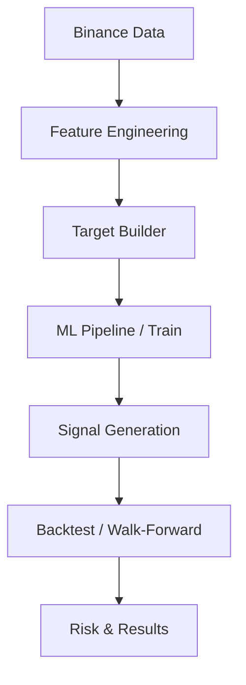

# MLTraderV2 — ML-Powered Cryptocurrency Trading System

Sistema de trading con machine learning para criptomonedas (Binance). Incluye pipeline de features, modelos XGBoost long/short, backtesting con Backtrader, walk-forward analysis, gestión de riesgo y una app Streamlit para entrenar y evaluar.


```mermaid
graph TD
    A[Binance Data] --> B[Feature Engineering]
    B --> C[Target Builder]
    C --> D[ML Pipeline / Train]
    D --> E[Signal Generation]
    E --> F[Backtest / Walk-Forward]
    F --> G[Risk & Results]
```

## Características

### Datos y features
- Obtención de klines desde Binance API con cache TTL y rate limiting
- Pipeline de features: precios, volumen, medias móviles, momentum (RSI, MACD, etc.), volatilidad (ATR, Bollinger), patrones candlestick, temporales
- Target builder con umbrales dinámicos (ATR), filtros de volatilidad/volumen/tendencia y métricas de calidad

### Machine Learning
- Modelos XGBoost separados para señales long y short
- Entrenamiento con split temporal y escalado solo en train (sin data leakage)
- Walk-forward out-of-sample y TimeSeriesSplit
- SMOTE opcional para desbalance; selección de features y optimización con Optuna
- Model registry para versionado de modelos y validación de features

### Backtest y estrategia
- Motor Backtrader: estrategia ML con ATR, stops adaptativos y gestión de posición
- Walk-forward analyzer (ventanas fijas o expanding) para validación robusta
- Métricas: Sharpe, drawdown, win rate, profit factor; robustness metrics y Monte Carlo

### Infraestructura
- Configuración unificada en `config/settings.py` (Pydantic-style con dataclasses)
- Logging centralizado (`core/logging_config.py`) y health check (`core/health.py`)
- Docker + docker-compose para ejecutar la app Streamlit con volúmenes para logs, datos y modelos
- Suite de tests con pytest (cobertura de core, ml, backtest, config)

## Requisitos

- Python 3.10+
- [TA-Lib](https://ta-lib.org/) (instalación según SO; en Windows puede requerir wheel precompilado)
- Cuenta Binance (opcional para datos en vivo; para backtest basta con CSV o API pública)

## Instalación

### 1. Clonar y entorno virtual

```bash
git clone https://github.com/luisklepa/MLTraderV2.git
cd MLTraderV2
python -m venv venv
# Windows:
venv\Scripts\activate
# Linux/macOS:
source venv/bin/activate
```

### 2. Dependencias

```bash
pip install -r requirements.txt
```

Si existe `requirements.lock` y quieres reproducir el entorno exacto:

```bash
pip install -r requirements.lock
```

### 3. Variables de entorno

Copia el ejemplo y ajusta (API keys solo necesarias para producción o descarga masiva):

```bash
cp .env.example .env
```

Edita `.env` según necesidad:

- `ENVIRONMENT=development` o `production`
- `BINANCE_API_KEY` / `BINANCE_API_SECRET` (obligatorios en production)
- `TELEGRAM_BOT_TOKEN` / `TELEGRAM_CHAT_ID` (opcional)
- `LOG_LEVEL`, `INITIAL_CAPITAL`, etc.

## Uso rápido

### App Streamlit (recomendado para explorar)

```bash
streamlit run app.py
```

Puerto por defecto: 8501. Desde la app puedes cargar configs YAML, entrenar modelos, ejecutar backtests y walk-forward.

### Entrenar modelo (CLI)

```bash
python -m ml.train_model
# o con dataset/opciones propias editando el bloque __main__
```

### Pipeline ML (config YAML)

```bash
python scripts/run_ml_pipeline.py --config config/ml_pipeline_config.yaml --output-dir results/
```

### Backtest con estrategia ML

```bash
python scripts/run_ml_backtest.py --config config/trading_config.yaml --start-date 2024-01-01 --end-date 2024-06-01 --output-dir results/
```

### Walk-forward

```bash
python scripts/run_walk_forward.py
```

### Descargar datos Binance

```bash
python scripts/download_data.py --symbol BTCUSDT --interval 15m --output data/btcusdt_prices.csv
```

### Health check (diagnóstico)

```bash
python -c "from core.health import check_health; import json; print(json.dumps(check_health(), indent=2))"
```

## Docker

```bash
docker-compose up --build
```

La app queda en `http://localhost:8501`. Volúmenes: `./logs`, `./data`, `./models`. Variables de entorno desde `.env`.

## Estructura del proyecto

```
MLTraderV2/
├── app.py                 # App Streamlit principal
├── core/                  # Núcleo compartido
│   ├── logging_config.py  # Configuración de logging
│   ├── health.py          # Health check
│   ├── data_fetcher.py    # Binance API + cache
│   ├── data_feed.py       # DataFeed / OptimizedDataFeed / MLSignalData
│   ├── file_management.py # Rutas y directorios desde YAML
│   └── ...
├── ml/                    # Machine learning
│   ├── feature_pipeline.py
│   ├── target_builder.py
│   ├── pipeline.py       # MLPipeline, FeatureEngine, ModelTrainer, SignalGenerator
│   ├── train_model.py
│   ├── model_registry.py
│   ├── model_optimization.py
│   ├── signal_filter.py
│   └── ...
├── backtest/              # Backtesting
│   ├── engine.py         # BacktestEngine (Backtrader)
│   ├── walk_forward.py
│   ├── robustness_metrics.py
│   ├── visualization.py
│   └── event_engine.py
├── strategies/            # Estrategias Backtrader
│   └── ml_strategy.py    # MLStrategy, EnhancedMLStrategy
├── config/                # Configuración
│   ├── settings.py       # TradingConfig, RiskConfig, DataConfig, etc.
│   ├── ml_pipeline_config.yaml
│   ├── trading_config.yaml
│   ├── walk_forward_config.py
│   └── robustness_config.py
├── scripts/               # Scripts ejecutables
│   ├── run_ml_pipeline.py
│   ├── run_ml_backtest.py
│   ├── run_walk_forward.py
│   ├── prepare_ml_dataset.py
│   ├── download_data.py
│   └── analysis/
├── tests/                 # Tests pytest
│   ├── conftest.py
│   ├── test_feature_pipeline.py
│   ├── test_pipeline.py
│   ├── test_train_model.py
│   ├── test_target_builder.py
│   ├── test_walk_forward.py
│   ├── test_engine.py
│   ├── test_data_feed.py
│   ├── test_model_optimization.py
│   ├── test_configs.py
│   └── ...
├── docker-compose.yml
├── Dockerfile
├── .env.example
├── requirements.txt
├── requirements.lock
└── pyproject.toml
```

## Tests

```bash
# Todos los tests
python -m pytest tests/ -v

# Con cobertura
python -m pytest tests/ -v --cov=core --cov=ml --cov=backtest --cov=config
```

Los entry points (app, scripts, `ml.train_model`, etc.) llaman a `setup_logging()` desde `core.logging_config` para unificar logs.

## Configuración relevante

- **Trading/riesgo:** `config/settings.py` — `TradingConfig`, `RiskConfig` (capital, comisión, max drawdown, position sizing).
- **Datos:** `DataConfig` — símbolo, timeframe, lookback, API Binance.
- **Pipeline ML:** `config/ml_pipeline_config.yaml` — modelos, features, umbrales.
- **Walk-forward:** `config/walk_forward_config.py` — tamaños de ventana, gap, métricas.
- **Robustez:** `config/robustness_config.py` — umbrales para tests de robustez.

## Documentación adicional

- [docs/ARCHITECTURE.md](docs/ARCHITECTURE.md)
- [docs/DEVELOPER_GUIDE.md](docs/DEVELOPER_GUIDE.md)
- [docs/TECHNICAL_DOCS.md](docs/TECHNICAL_DOCS.md)
- [CONTRIBUTING.md](CONTRIBUTING.md)

## Aviso

Este proyecto es para **educación e investigación**. El trading conlleva riesgos; los resultados pasados en backtest no garantizan resultados futuros. No se ofrece asesoramiento financiero.

## Licencia

MIT — ver [LICENSE](LICENSE).

## Autor

- **Luis Klepatzky** — [@luisklepa](https://github.com/luisklepa) — Luisklepa@Thesynaptek.com

## Agradecimientos

- [XGBoost](https://xgboost.readthedocs.io/), [scikit-learn](https://scikit-learn.org/), [Backtrader](https://www.backtrader.com/), [TA-Lib](https://ta-lib.org/), [Binance API](https://binance-docs.github.io/apidocs/), [Streamlit](https://streamlit.io/).
