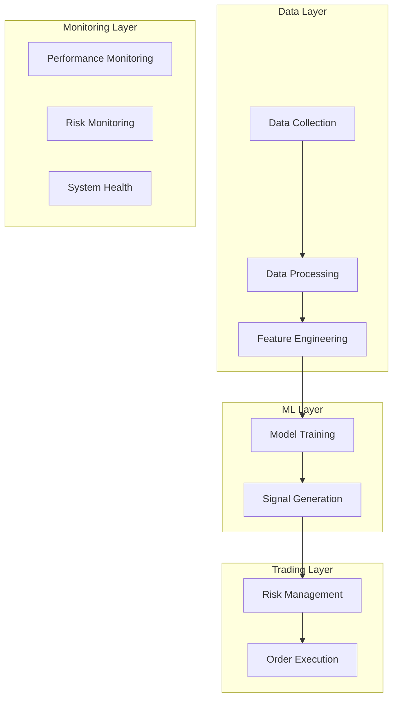

# System Architecture

## Overview

This document provides a high-level overview of the cryptocurrency ML trading system architecture. The system is designed to be modular, scalable, and maintainable.

## System Components



## Directory Structure

```
Backtrader/
├── analysis/           # Analysis tools and scripts
├── backtest/          # Backtesting engine
├── config/            # Configuration files
├── data/              # Data storage
│   ├── raw/          # Raw market data
│   ├── processed/    # Processed features
│   └── cache/        # Cached computations
├── indicators/        # Technical indicators
├── logs/             # System logs
├── ml_pipeline/      # ML training pipeline
├── models/           # Trained models
├── optimization/     # Optimization tools
├── results/          # Trading results
├── scripts/          # Utility scripts
├── strategies/       # Trading strategies
├── tests/            # Test suite
└── utils/            # Utility functions
```

## Component Details

### 1. Data Layer

#### Data Collection
- Handles market data retrieval
- Supports multiple data sources
- Implements data validation
- Manages data storage

#### Data Processing
- Cleans and preprocesses data
- Handles missing values
- Normalizes data formats
- Implements data quality checks

#### Feature Engineering
- Calculates technical indicators
- Generates derived features
- Implements feature selection
- Manages feature versioning

### 2. ML Layer

#### Model Training
- Implements model pipeline
- Handles data splitting
- Manages cross-validation
- Performs hyperparameter tuning

#### Signal Generation
- Processes model predictions
- Applies signal filters
- Generates trading signals
- Calculates signal confidence

### 3. Trading Layer

#### Risk Management
- Implements position sizing
- Manages portfolio risk
- Calculates risk metrics
- Enforces risk limits

#### Order Execution
- Handles order placement
- Manages order lifecycle
- Implements execution logic
- Tracks order status

### 4. Monitoring Layer

#### Performance Monitoring
- Tracks trading performance
- Calculates performance metrics
- Generates performance reports
- Monitors strategy health

#### Risk Monitoring
- Tracks risk metrics
- Monitors exposure limits
- Generates risk reports
- Implements risk alerts

#### System Health
- Monitors system status
- Tracks resource usage
- Generates health reports
- Implements alerts

## Data Flow

1. Market Data Collection
   ```mermaid
   sequenceDiagram
       participant Exchange
       participant DataCollector
       participant Storage
       
       Exchange->>DataCollector: Raw market data
       DataCollector->>DataCollector: Validate data
       DataCollector->>Storage: Store validated data
   ```

2. Feature Engineering
   ```mermaid
   sequenceDiagram
       participant Storage
       participant FeatureEngine
       participant Cache
       
       Storage->>FeatureEngine: Raw data
       FeatureEngine->>FeatureEngine: Calculate features
       FeatureEngine->>Cache: Cache results
       FeatureEngine->>Storage: Store features
   ```

3. Model Pipeline
   ```mermaid
   sequenceDiagram
       participant Storage
       participant ModelTrainer
       participant ModelEvaluator
       participant ModelRegistry
       
       Storage->>ModelTrainer: Training data
       ModelTrainer->>ModelTrainer: Train model
       ModelTrainer->>ModelEvaluator: Evaluate model
       ModelEvaluator->>ModelRegistry: Register model
   ```

4. Trading Pipeline
   ```mermaid
   sequenceDiagram
       participant ModelRegistry
       participant SignalGenerator
       participant RiskManager
       participant OrderExecutor
       
       ModelRegistry->>SignalGenerator: Model predictions
       SignalGenerator->>RiskManager: Trading signals
       RiskManager->>OrderExecutor: Sized orders
   ```

## Configuration Management

### 1. Model Configuration
```yaml
model:
  type: xgboost
  params:
    n_estimators: 1000
    max_depth: 8
    learning_rate: 0.01
  features:
    - price_features
    - volume_features
    - technical_indicators
```

### 2. Trading Configuration
```yaml
trading:
  risk_limits:
    max_position_size: 1.0
    max_drawdown: 0.20
    max_leverage: 3.0
  signal_thresholds:
    entry: 0.40
    exit: 0.35
```

### 3. System Configuration
```yaml
system:
  data_sources:
    - binance
    - coinbase
  cache_settings:
    max_size: 1GB
    ttl: 3600
  logging:
    level: INFO
    handlers:
      - console
      - file
```

## Error Handling

### 1. Data Layer
- Validates data integrity
- Handles missing data
- Manages connection issues
- Implements retry logic

### 2. ML Layer
- Validates model inputs
- Handles prediction errors
- Manages model failures
- Implements fallback logic

### 3. Trading Layer
- Validates order parameters
- Handles execution errors
- Manages position limits
- Implements safety checks

## Performance Optimization

### 1. Data Processing
- Parallel computation
- Efficient data structures
- Memory management
- Caching strategy

### 2. Model Execution
- Batch processing
- GPU acceleration
- Model compression
- Inference optimization

### 3. System Resources
- CPU utilization
- Memory usage
- Disk I/O
- Network bandwidth

## Monitoring and Alerting

### 1. Performance Metrics
- Returns and drawdown
- Sharpe and Sortino ratios
- Win rate and profit factor
- Risk-adjusted returns

### 2. Risk Metrics
- Value at Risk (VaR)
- Expected Shortfall
- Position exposure
- Portfolio correlation

### 3. System Metrics
- CPU and memory usage
- Disk space and I/O
- Network latency
- Error rates

## Development Guidelines

### 1. Code Organization
- Modular architecture
- Clear dependencies
- Consistent structure
- Documentation standards

### 2. Testing Strategy
- Unit tests
- Integration tests
- Performance tests
- Regression tests

### 3. Deployment Process
- Version control
- Code review
- Testing pipeline
- Release management

## Future Improvements

### 1. Technical Enhancements
- Real-time processing
- Distributed computing
- Advanced optimization
- Enhanced monitoring

### 2. Feature Additions
- Additional data sources
- New ML models
- Advanced risk metrics
- Portfolio optimization

### 3. System Upgrades
- Scalability improvements
- Performance optimization
- Enhanced monitoring
- Additional safety features 