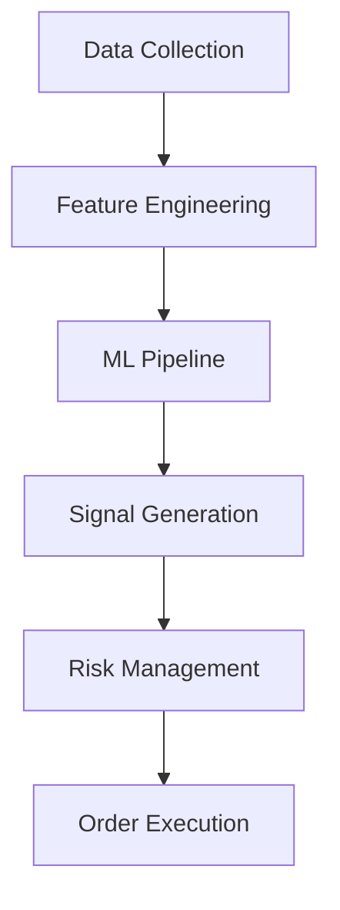

# Technical Documentation

## Table of Contents
1. [System Overview](#system-overview)
2. [Core Components](#core-components)
3. [Machine Learning Pipeline](#machine-learning-pipeline)
4. [Trading Strategy](#trading-strategy)
5. [Risk Management](#risk-management)
6. [Performance Optimizations](#performance-optimizations)

## System Overview

### Architecture
The system follows a modular architecture with these key components:


### Data Flow
1. Raw market data is collected
2. Features are engineered and preprocessed
3. ML models generate predictions
4. Signals are filtered and sized
5. Risk management rules are applied
6. Orders are executed

## Core Components

### 1. Data Pipeline (`utils/data_feed.py`)
```python
def load_data(file_path: str) -> pd.DataFrame:
    """
    Loads and preprocesses market data.
    
    Parameters:
        file_path (str): Path to the data file
        
    Returns:
        pd.DataFrame: Processed market data with columns:
            - timestamp: datetime index
            - open: Opening price
            - high: High price
            - low: Low price
            - close: Closing price
            - volume: Trading volume
    """
```

### 2. Feature Engineering (`utils/feature_engineering.py`)
Key features calculated:
- Technical indicators (RSI, MACD, etc.)
- Market regimes
- Volatility metrics
- Price patterns
- Volume analysis

Example:
```python
def calculate_market_regime(
    prices: pd.Series,
    volume: pd.Series,
    window: int = 20
) -> pd.DataFrame:
    """
    Calculates market regime indicators.
    
    Parameters:
        prices: Price series
        volume: Volume series
        window: Lookback window
        
    Returns:
        DataFrame with columns:
        - trend_strength
        - volatility_regime
        - volume_regime
    """
```

## Machine Learning Pipeline

### 1. Model Architecture
- Separate models for long and short signals
- XGBoost classifier base
- Feature selection and importance analysis
- Hyperparameter optimization

### 2. Training Process
```python
class MLPipeline:
    def train_model(self, X: pd.DataFrame, y: pd.Series) -> None:
        """
        Trains the ML model with the following steps:
        1. Feature selection
        2. Data preprocessing
        3. Class balancing (SMOTE)
        4. Model training
        5. Performance evaluation
        """
```

### 3. Feature Importance
Top features by importance:
1. Price to resistance (0.3341)
2. Price to support (0.1947)
3. Price to EMA-50 ratio (0.1121)
4. Volatility 50-period (0.0545)
5. Volume trend confirmation (0.0485)

### 4. Hyperparameters
```yaml
model_params:
  n_estimators: 1000
  max_depth: 8
  learning_rate: 0.01
  min_child_weight: 3
  subsample: 0.8
  colsample_bytree: 0.8
  gamma: 0.1
```

## Trading Strategy

### 1. Signal Generation
```python
def generate_signals(
    self,
    probabilities: np.ndarray,
    threshold: float = 0.40,
    min_probability: float = 0.45
) -> pd.DataFrame:
    """
    Generates trading signals based on model predictions.
    
    Parameters:
        probabilities: Model prediction probabilities
        threshold: Minimum threshold for signal generation
        min_probability: Minimum probability for position sizing
        
    Returns:
        DataFrame with columns:
        - signal: 1 (long), -1 (short), 0 (neutral)
        - position_size: Position size (0.0 to 1.0)
        - confidence: Signal confidence score
    """
```

### 2. Position Sizing
Position size is calculated based on:
- Signal probability
- Market volatility
- Current drawdown
- Risk limits
- Portfolio exposure

### 3. Entry/Exit Rules
```python
def calculate_entry_exit(
    signal: int,
    price: float,
    volatility: float
) -> Tuple[float, float, float]:
    """
    Calculates entry, stop-loss, and take-profit levels.
    
    Returns:
        Tuple containing:
        - entry_price: Price level for entry
        - stop_loss: Stop-loss level
        - take_profit: Take-profit level
    """
```

## Risk Management

### 1. Position Sizing
```python
def calculate_position_size(
    self,
    probability: float,
    volatility: float,
    current_drawdown: float
) -> float:
    """
    Calculates optimal position size based on:
    - Signal probability (higher prob = larger size)
    - Market volatility (higher vol = smaller size)
    - Current drawdown (larger DD = smaller size)
    - Maximum position limits
    """
```

### 2. Risk Metrics
Key metrics monitored:
- Value at Risk (VaR)
- Expected Shortfall
- Maximum Drawdown
- Sharpe Ratio
- Sortino Ratio

### 3. Portfolio Management
```python
def optimize_portfolio(
    self,
    positions: Dict[str, float],
    correlations: pd.DataFrame
) -> Dict[str, float]:
    """
    Optimizes portfolio weights considering:
    - Position correlations
    - Risk limits
    - Portfolio constraints
    """
```

## Performance Optimizations

### 1. Data Processing
```python
class PerformanceOptimizer:
    """
    Handles performance optimizations:
    - Parallel feature calculation
    - Memory-efficient data processing
    - Caching system
    - Numeric operation optimization
    """
```

### 2. Model Optimization
```python
class ModelOptimizer:
    """
    Handles model optimizations:
    - Feature selection
    - Hyperparameter tuning
    - Model performance monitoring
    - Automated retraining
    """
```

### 3. Risk Optimization
```python
class RiskOptimizer:
    """
    Handles risk optimizations:
    - Dynamic position sizing
    - Portfolio optimization
    - Risk metric calculations
    """
```

## Code Examples

### 1. Feature Engineering
```python
# Calculate technical indicators
def calculate_indicators(data: pd.DataFrame) -> pd.DataFrame:
    df = data.copy()
    
    # RSI
    df['rsi'] = talib.RSI(df['close'], timeperiod=14)
    
    # MACD
    macd, signal, hist = talib.MACD(
        df['close'],
        fastperiod=12,
        slowperiod=26,
        signalperiod=9
    )
    df['macd'] = macd
    df['macd_signal'] = signal
    df['macd_hist'] = hist
    
    return df
```

### 2. Signal Generation
```python
# Generate trading signals
def generate_signals(predictions: pd.Series, threshold: float) -> pd.Series:
    signals = pd.Series(index=predictions.index)
    signals[predictions > threshold] = 1  # Long signals
    signals[predictions < -threshold] = -1  # Short signals
    signals.fillna(0, inplace=True)  # Neutral
    return signals
```

### 3. Position Sizing
```python
# Calculate position size
def calculate_position_size(
    probability: float,
    volatility: float,
    max_size: float = 1.0
) -> float:
    # Base size from probability
    base_size = max_size * (probability - 0.5) * 2
    
    # Volatility adjustment
    vol_factor = 1.0 / (1.0 + volatility)
    
    # Final size
    position_size = base_size * vol_factor
    
    return max(min(position_size, max_size), -max_size)
```

## Performance Considerations

### 1. Memory Usage
- Use appropriate data types
- Process large datasets in chunks
- Implement caching for frequent calculations

### 2. Computation Speed
- Parallel processing for feature calculation
- Vectorized operations
- Efficient data structures

### 3. Real-time Processing
- Streaming data handling
- Quick signal generation
- Efficient risk calculations

## Error Handling

### 1. Data Validation
```python
def validate_data(data: pd.DataFrame) -> bool:
    """
    Validates input data:
    - Required columns present
    - No missing values
    - Correct data types
    - Valid value ranges
    """
```

### 2. Signal Validation
```python
def validate_signals(signals: pd.DataFrame) -> bool:
    """
    Validates trading signals:
    - Signal values in [-1, 0, 1]
    - Position sizes within limits
    - No conflicting signals
    """
```

## Logging and Monitoring

### 1. Performance Logging
```python
def log_performance(metrics: Dict[str, float]) -> None:
    """
    Logs performance metrics:
    - Returns
    - Sharpe ratio
    - Maximum drawdown
    - Win rate
    """
```

### 2. Error Logging
```python
def log_error(error: Exception, context: str) -> None:
    """
    Logs error information:
    - Error type and message
    - Stack trace
    - Context information
    """
```

## Testing

### 1. Unit Tests
```python
def test_signal_generation():
    """
    Tests signal generation:
    - Correct signal values
    - Position sizing
    - Risk limits
    """
```

### 2. Integration Tests
```python
def test_full_pipeline():
    """
    Tests complete pipeline:
    - Data processing
    - Feature engineering
    - Model prediction
    - Signal generation
    - Risk management
    """
``` 